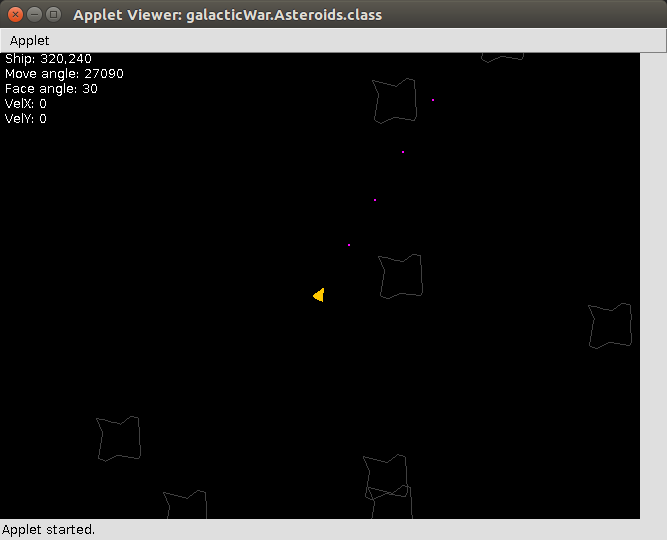

# asteroids

Game prototype based on the book "Beginning Sava SE 6 Game Programming, Third Edition" by Jonathan S. Harbour.

## About

This is the Eclipse-project for the prototype of the game "Asteroids", using Jave 6 SE. This is a quick project,
testing out threads and graphics in Java.

The prototype currently feature a 600x400 game-window running 2 threads, maintaining 50 FPS. There is a controllable
ship that can fire, asteroids, and collision detection.

## Note

There is currently an issue with vertical acceleration of the ship.
